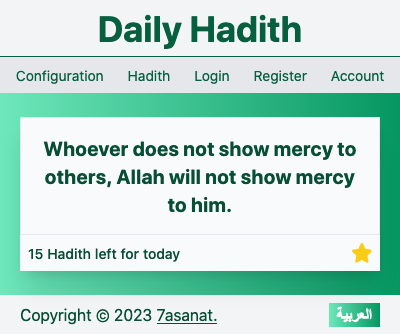
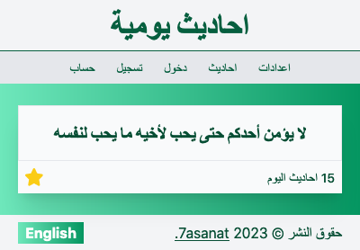
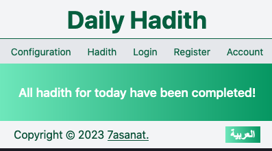
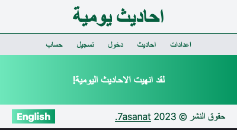
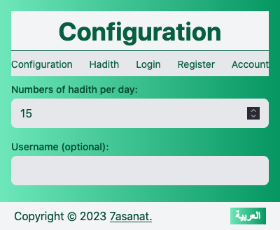
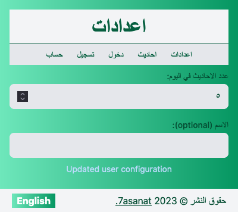

# 7asanat - Prophet Peace Upon Him Sayings Reminder

This browser extension reminds the user of Prophet peace upon him sayings at timed intervals throughout the day. It is a gamified version of a reminder, where the user can choose a daily goal, like 5 or 50, and when clicking on the star button it is hidden. When the user is logged in, they can track their progress within a leaderboard, either daily, monthly, or yearly.

## Features
* Display Hadith randomly selected from a database of hundreds of options.
* Supports multiple languages, Version 1 will suppot English & Arabic with plans to add more gradually.

## ScreenShot

### Hadith Section

| English | Arabic |
| --- | --- |
|  |  |

### Empty Hadith Section

| English | Arabic |
| --- | --- |
|  |  |

### Config Section

| English | Arabic |
| --- | --- |
|  |  |

## Contributing

We would love to see your contributions to this project! If you have any ideas for features or improvements, please feel free to open an issue or pull request.
License
